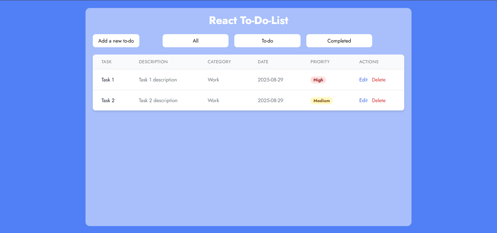
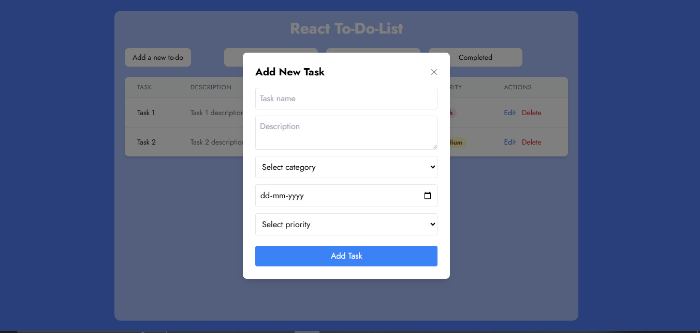

# Todo List App

# React Todo List App

A modern **React** application for managing tasks with features like adding, editing, and deleting tasks. State management is handled using **Context API**.

---

## Features

- Add tasks with **title, description, category, date, and priority**
- Edit and delete tasks seamlessly
- Tasks are managed globally with **Context API**
- Responsive design with **Tailwind CSS**

---

## Screenshots

### Task List View



### Add/Edit Task Modal



---

## Installation

1. Clone the repository:

```bash
git clone https://github.com/your-username/todo-list-app.git

cd todo-list-app

npm install

npm run dev


Technologies Used

*)React
*)Context API for state management
*)Tailwind CSS for styling
*)Vite for fast build and dev environment


```


